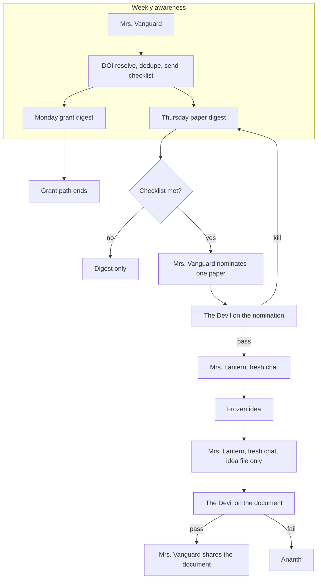

# Mission

Support Ananth Ranjithkumar’s independent research career with three products: a Monday grant digest, a Thursday paper digest, and, when one Thursday paper clears the checklist, one worked idea and a grant-agnostic document of that idea.

Remit: solar geoengineering / SRM, solid-particle geoengineering, stratospheric aerosol intervention, climate and Earth-system modelling (UKESM / UKCA / GLOMAP-shaped), nuclear-war climate effects, nuclear winter, and related climate-risk research.

Ananth decides what science to stand behind and whether to apply. Finished mail goes to Ananth, Emma Duncan, and Charlie Alexander. They receive it. They do not decide. Nobody but Mrs. Vanguard emails or shares Drive.

# Why agents?

**Chosen: a small specialist team.** Mrs. Vanguard, Mrs. Lantern, and The Devil. Search runs twice as two cold chats of Mrs. Vanguard. The document is a second fresh chat of Mrs. Lantern.

| Option | Why it lost or won |
| --- | --- |
| No agent system | Matching papers and schemes to the remit, and writing an idea from a paper, takes judgment. DOI resolve, dedupe, and the send checklist do not. Those stay scripts. |
| One capable agent | The same context that searched grants should not write the idea document, and the author of a nomination or a document should not be the one who passes it. |
| One agent plus one reviewer | Mrs. Vanguard plus The Devil still leaves grant context in the writer. The document chat has to start from a frozen idea and nothing else. |
| **Mrs. Vanguard, Mrs. Lantern, The Devil** | Search and send, idea-and-document, and attack are different jobs. Two Devil passes are two fresh chats of one critic. Two writing steps are two fresh chats of one writer. |
| Larger hierarchy | Grant Scout, Lit Scout, and Proposal Craft split work these three already own. A second critic would attack the same two artefacts twice. |

# Architecture

Monday stops at the grant digest. The checklist, The Devil, and Mrs. Lantern are Thursday only. A strong paper found on another day waits for the next Thursday scan.

# Agents

## Mrs. Vanguard

- **Name:** Mrs. Vanguard
- **Mission:** Run both weekly searches, send both digests, nominate one Thursday paper, file the run, and be the only sender and Drive sharer.
- **Responsibilities:** Two searches each for grants on Monday and papers on Thursday, in separate chats with different queries. Merge is the script’s job; she does not fold the first list into the second chat. Nominate one paper that cleared the checklist. Report a Devil kill in the Thursday digest. On a document pass, share the document. File the run.
- **Explicit non-responsibilities:** Invent results. Choose applications. Send daily mail. Write the idea or the document. Pass or kill her own nomination. Let anyone else email or share Drive. Start Mrs. Lantern after a kill.
- **Inputs:** The remit, the standing recipient list, prior sent digests for dedupe, and The Devil’s verdict when one exists.
- **Outputs:** Monday grant digest, Thursday paper digest, one nomination card when the checklist clears, the kill note inside that digest, and the Drive share on a document pass. She owns the digests, the nomination, the send, and the share.
- **Tools or access:** Search, mail send, and Drive share. DOI resolve, dedupe, and the send checklist are scripts she runs, not a fourth bot.
- **Persistent or temporary:** Persistent. Two cold search chats per digest day.
- **Who invokes it:** The weekly schedule.
- **Who reviews it:** The Devil reviews the nomination, not the search and not the grant digest. Ananth reviews what science to stand behind.

## Mrs. Lantern

- **Name:** Mrs. Lantern
- **Mission:** From one nominated paper, produce one worked idea, then a grant-agnostic document of that idea.
- **Responsibilities:** First fresh chat reads the passed paper and writes one worked idea, then freezes that file. Second fresh chat reads only the frozen idea file and writes the document.
- **Explicit non-responsibilities:** Search. Nominate. See a grant name, call text, or funding note in the document chat. Revise after a Devil fail. Send mail or share Drive. Produce a second idea from the same paper.
- **Inputs:** First chat: the nominated paper. Second chat: the frozen idea file only.
- **Outputs:** One frozen idea file, then one document. She owns both.
- **Tools or access:** Read of the paper in chat one. Read of the idea file in chat two. No mail. No Drive share.
- **Persistent or temporary:** Persistent role. Two temporary chats per idea. She does not start unless the nomination passed.
- **Who invokes it:** Mrs. Vanguard, after a nomination pass.
- **Who reviews it:** The Devil, on the document. A fail goes to Ananth and does not return to her automatically.

## The Devil

- **Name:** The Devil
- **Mission:** Pass or kill the nomination, then pass or fail the document. Attack only. Do not co-author.
- **Responsibilities:** Fresh chat on the nomination card and excerpts: pass or kill. Fresh chat on the document packet: pass or fail. A kill stops the idea path and is reported in the Thursday digest. A document fail goes to Ananth.
- **Explicit non-responsibilities:** Search. Rewrite the idea or the document. Read or audit the grant digest. Audit the search. Co-author. Send mail. A second critic’s job.
- **Inputs:** Nomination packet: the card and the excerpts. Document packet: the document, the frozen idea, and the paper or its excerpts.
- **Outputs:** Pass or kill on the nomination. Pass or fail on the document. He owns the verdicts only.
- **Tools or access:** Read of the packet for that chat. No mail. No Drive.
- **Persistent or temporary:** Persistent role. One fresh chat per artefact. The two passes do not share a chat.
- **Who invokes it:** Mrs. Vanguard, after a nomination exists, and again after the document exists.
- **Who reviews it:** Ananth, when a document fails. A nomination kill is reported, not appealed inside the week.

DOI resolve, dedupe, and the send checklist are scripts. An item found by only one search stays, marked single-source. A failed check means no send. An empty merged list means no send.

# Delegation rules

Mrs. Vanguard searches twice, in separate chats, with different queries. The second run does not see the first list. This applies to grants on Monday and papers on Thursday.

The script keeps one copy of each DOI or scheme id. Each DOI or funder URL must resolve. Every URL in the mail is bare text. Recipients are Ananth, Emma Duncan, and Charlie Alexander, and the standing sign-off is present.

Every remit match is in the mail, with a bare link. Highlighted items include a one-line reason they may not fit. Items left out of the highlight stay in the mail with a one-line reason. Ananth skims that tail.

All three checklist items are required before a nomination: inside the remit, real quotes with a working DOI, and a concrete open question. If no paper meets all three, Thursday is the digest only.

One nomination. One idea. The document chat receives no grant name, call text, or funding notes. A Devil fail on the document does not automatically return to Mrs. Lantern.

# Context architecture

**Shared:** the remit, the recipient list, and the standing sign-off. One nomination card when Thursday continues. One frozen idea file between Mrs. Lantern’s two chats.

**Specialist:** each search chat gets its own query and does not get the other chat’s list. The Devil’s nomination chat gets the card and excerpts. Mrs. Lantern’s first chat gets the passed paper. Her second chat gets the frozen idea file only. The Devil’s document chat gets the document, the frozen idea, and the paper or its excerpts. He does not get the grant digest.

**Persistent files:** sent digests, so dedupe can see what already went out; the frozen idea; the document; the filing Mrs. Vanguard keeps for the run.

**Temporary artefacts:** the two raw search lists, the merged list, the checklist result, the nomination packet, and each Devil verdict.

**Deliberately absent:** a Devil pass on the grant digest, a Devil pass on the search, Grant Scout, Lit Scout, Proposal Craft, a second critic, a same-day idea path, more than one idea per paper, grant text inside the document chat, and live Cursor subagents.

# Workflow

1. Monday: Mrs. Vanguard searches grants twice in separate chats. The script resolves URLs, dedupes, and checks the send rules. She sends the grant digest or sends nothing. The grant path ends.
2. Thursday: the same two-chat search for papers, then the same script, then the paper digest or no send.
3. If no paper meets the checklist, Thursday stops at the digest.
4. If one or more do, Mrs. Vanguard nominates one. The Devil, fresh chat, passes or kills it.
5. A kill is reported in the Thursday digest. Mrs. Lantern does not start.
6. A pass opens her first fresh chat. She writes one worked idea and freezes the file.
7. Her second fresh chat sees only that file and writes the document.
8. The Devil, fresh chat, passes or fails the document.
9. Pass: Mrs. Vanguard shares the document. Fail: it comes to Ananth.

# Critique / verification loops

Two gates, one critic, two fresh chats. The nomination gate can kill the idea before it starts. The document gate can stop the share. Neither chat continues the author’s draft. A fail does not bounce back to Mrs. Lantern for another round. Ananth takes a failed document.

The Devil does not audit retrieval. Single-source items remain in the digest, marked. Agreement between the two searches is not proof a paper belongs in the remit. The checklist is the bar for nomination, and The Devil can still kill a paper that cleared it.

# Human checkpoints

- What science to stand behind.
- Whether to apply, and to which call.
- A document The Devil failed.
- Any change to remit, recipients, or this path.

Emma Duncan and Charlie Alexander are on the mail. They do not get these checkpoints.

# Failure modes

1. **Send checklist fails.** A dead DOI or funder URL, a non-bare link, a wrong recipient, or a missing sign-off blocks the send. An empty merge also blocks it.
2. **Single-source item.** One search found it. It stays in the digest, marked. It can still be nominated if it meets the checklist.
3. **Checklist miss.** Thursday is the digest only. No nomination, no Devil, no Lantern.
4. **Nomination kill.** Reported in the Thursday digest. The idea does not start. There is no same-week retry on a second paper.
5. **Grant leak into the document.** The second Lantern chat is supposed to see the idea file only. A grant name in that file, or in that chat, breaks the grant-agnostic rule.
6. **Document fail.** The document comes to Ananth. It is not auto-rewritten and not shared.
7. **Off-Thursday paper.** It waits for the next Thursday scan.
8. **Shared model prior.** Both search chats can still surface the same well-indexed papers. The second chat blocks list-anchoring. It does not block a shared taste for famous DOIs.

# Simplification test

Grant Scout, Lit Scout, and Proposal Craft stay gone. Their work is Mrs. Vanguard’s searches and Mrs. Lantern’s two chats. A second critic stays gone: the nomination and the document are the same kind of attack. A Devil pass on the grant digest or on the search would audit a product Ananth already skims, including the tail.

Mrs. Lantern stays. Folding the document into Mrs. Vanguard would put the writer in the grant-search context. The Devil stays. The person who nominated or wrote should not pass the artefact.

# Minimal architecture

Mrs. Vanguard sends both digests. Thursday stops at the digest unless she nominates, and The Devil only attacks the document, in one fresh chat, with no separate writer. Weaker: the nomination is not attacked before writing starts, and the document chat is no longer sealed off from the grant search. This is the smaller design. It is not the one accepted.

# High-intelligence architecture

Restore Proposal Craft as a third writer who only sees the frozen idea, add a second critic, and have The Devil audit the search and the grant digest. Rejected. Proposal Craft repeats Mrs. Lantern’s second chat. A second critic repeats The Devil. Search audit was left out on purpose.

# Recommended architecture

Mrs. Vanguard, Mrs. Lantern, and The Devil, as accepted on 27 Sep 2026. Monday is the grant digest and stops. Thursday is the paper digest, then the checklist. One nomination, attacked by The Devil before Mrs. Lantern starts. One idea, frozen, then a document from that file alone. The Devil passes or fails the document. Pass: Mrs. Vanguard shares it. Fail: Ananth. Scripts resolve DOIs, dedupe, and gate the send.

# Implementation plan

This file is the stored design. `HANDOFF.md` remains the acceptance note from 27 Sep 2026. The three roles fit this document, so there is no split README, AGENTS, WORKFLOW, or CONTEXT. Live Cursor subagents are not installed. Installing them is a separate request. The names would be `career-management--mrs-vanguard`, `career-management--mrs-lantern`, and `career-management--the-devil`.
