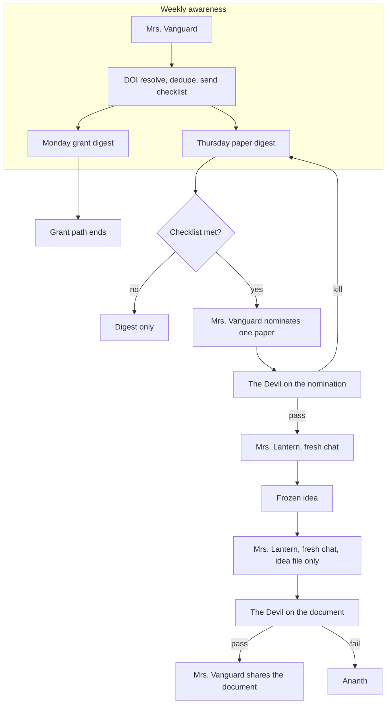

# Career management

Open this folder as its own Cursor project (File → Open Folder → `output/career-management`). Use `AGENTS.md` as the front door and the role files under `.cursor/agents/` when you invoke a specialist.

The frozen design is `ARCHITECTURE.md`. Do not redesign from this README.

## Flowchart

## Site

Edit `site/index.html` for homepage changes. Leave `site/index_original.html` alone.

## Human checkpoints

- What science to stand behind.
- Whether to apply, and to which call.
- A document The Devil failed.
- Any change to remit, recipients, or this path.

