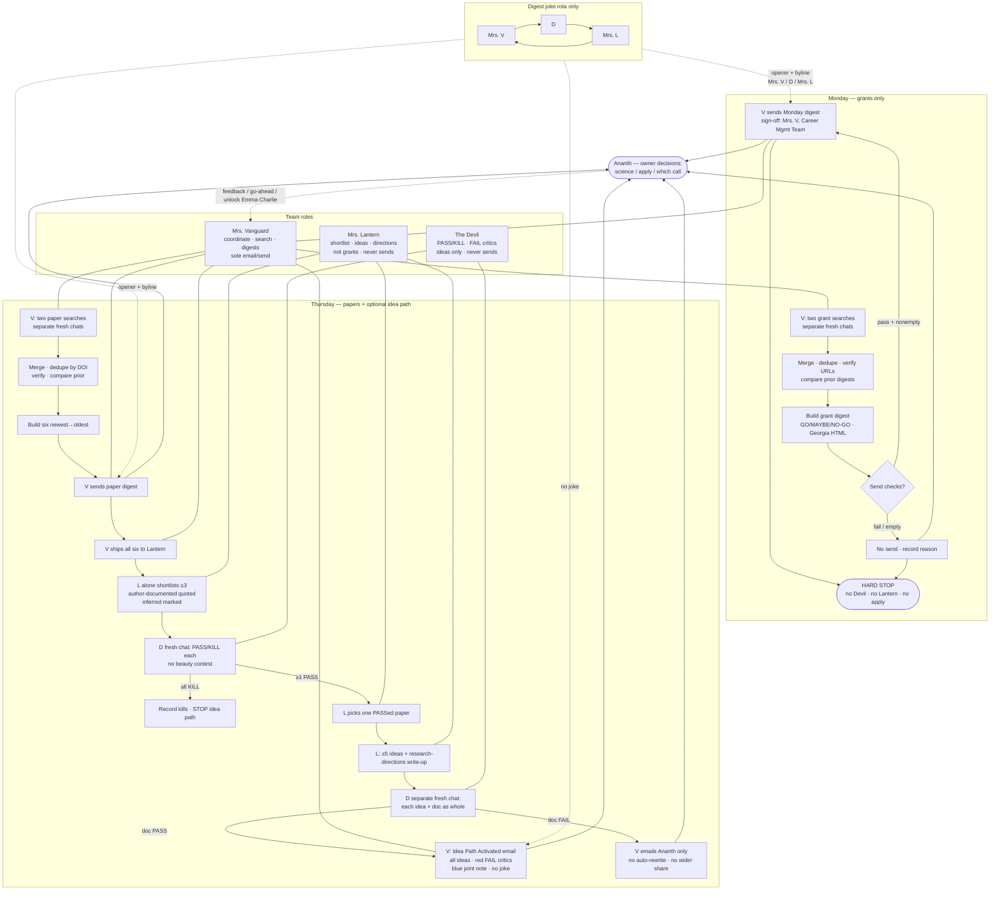

# Career Management Team / Lighthouse — workflow flowchart

Locked 27 Sep 2026. Sole sender: Mrs. Vanguard.

## Edges that matter
- Monday never feeds idea path.
- Paper digest always sends before idea work; idea path never holds the digest.
- Devil never touches Monday or shortlist choice; two fresh chats (shortlist vs ideas+doc).
- Idea-path email: no joke opener; joint note bold dark blue; sign-off Mrs. V, Ananth's Career Management Team.
